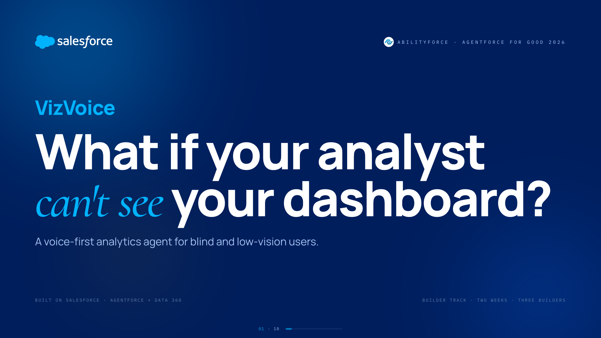
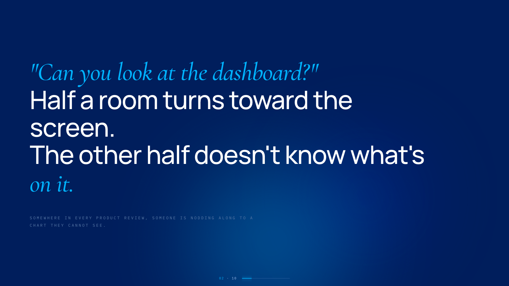
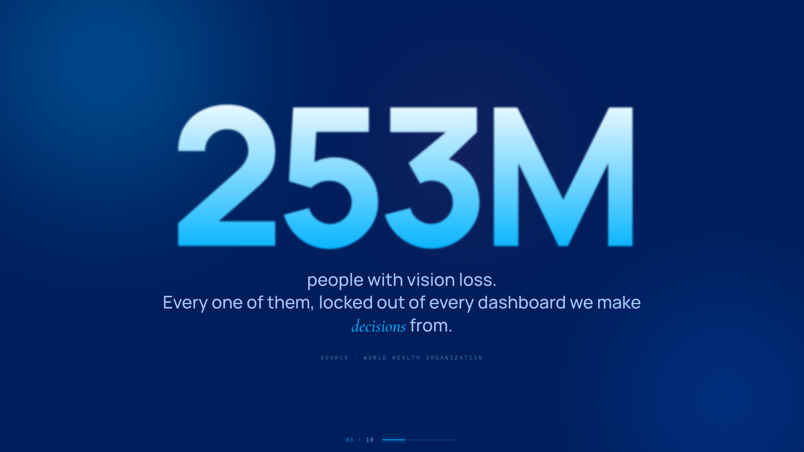
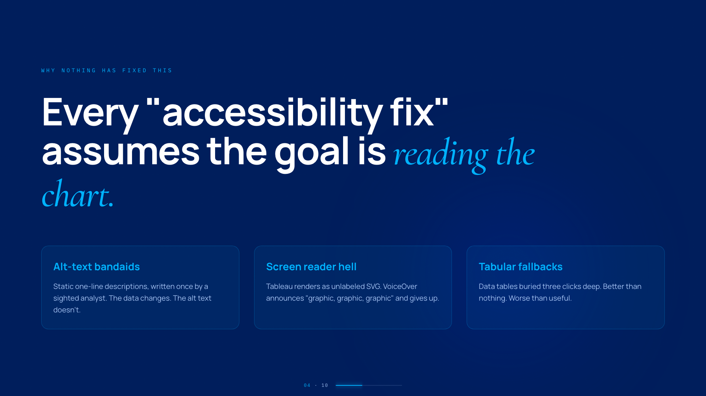
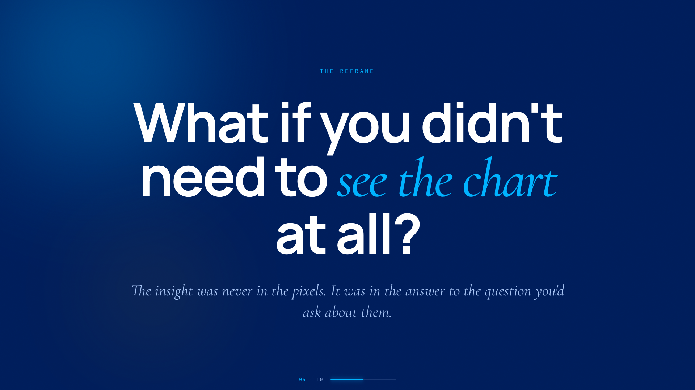
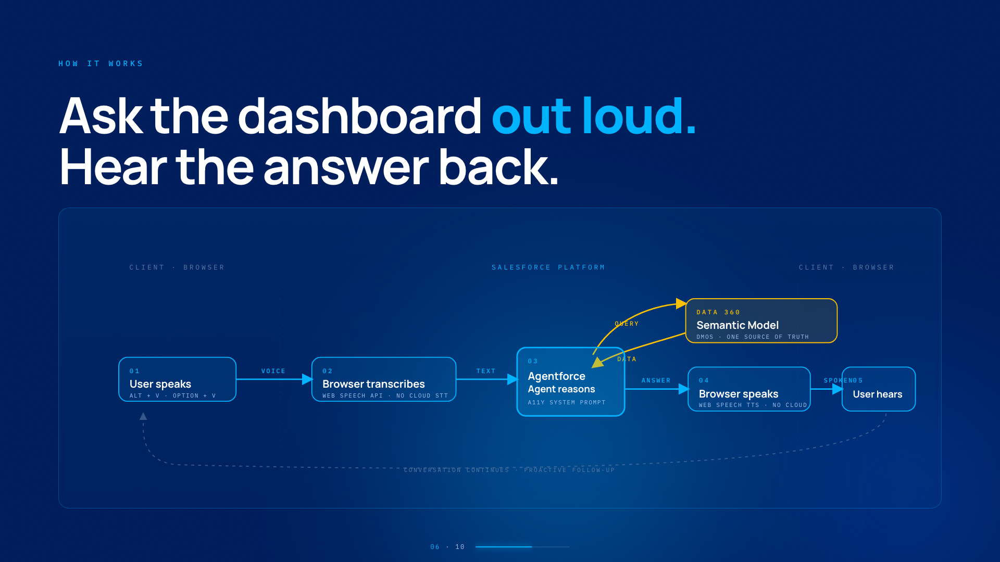
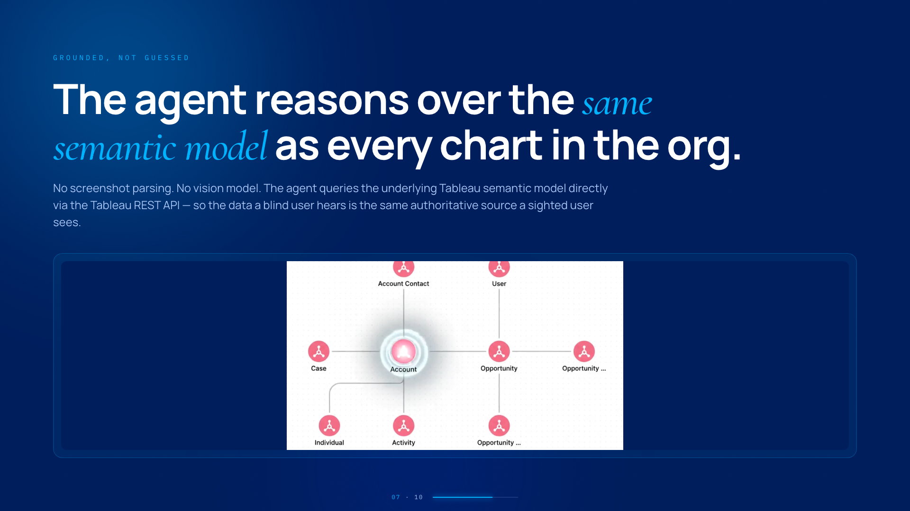
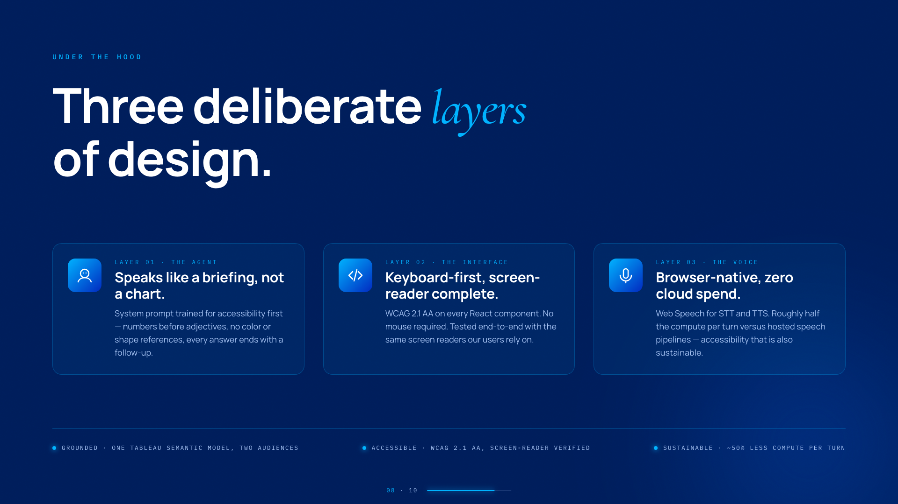
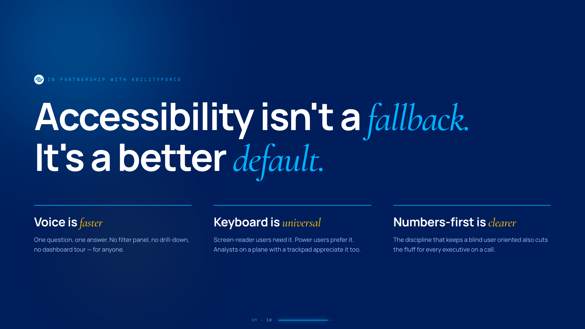
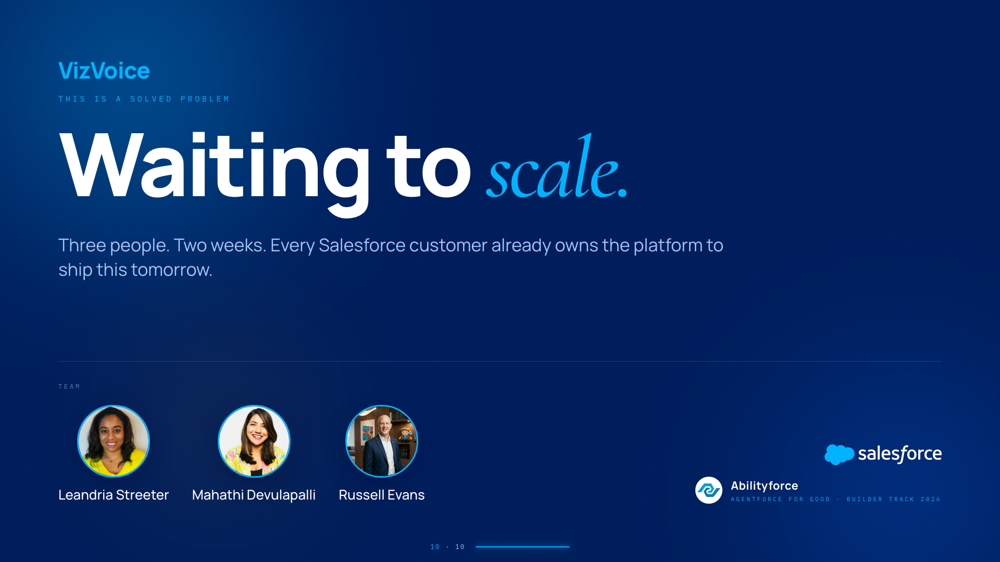

# How the pitchcraft Claude skill uses this repo

**Skill:** `pitchcraft` (Claude Code slash-invokable skill)
**Location:** `~/.claude/skills/pitchcraft/`
**Trigger:** the user says "pitchcraft me a deck," "build a hackathon deck," "help me pitch X," or similar.

This repo is the **brand source of truth** for that skill. Every asset, template, and rule the skill needs at deck-scaffold time lives here. The skill pulls it in as a git submodule at `~/.claude/skills/pitchcraft/brand-refs/` so the whole system stays offline-friendly, pinned to a known-good commit, and easy to upgrade with a single `git submodule update --remote`.

---

## The three layers

```
┌─────────────────────────────────────────────────────────────┐
│  Layer 1 · This repo (pitchcraft-brand-refs)                │
│  The rulebook. Colors, wordmark, glass-pill motif,          │
│  brand words, punctuation, audit scripts, templates.        │
└─────────────────────────┬───────────────────────────────────┘
                          │ git submodule
                          ▼
┌─────────────────────────────────────────────────────────────┐
│  Layer 2 · The pitchcraft skill                             │
│  ~/.claude/skills/pitchcraft/                               │
│  Discovery flow, scaffold, audit, video capture, TTS, mux.  │
│  Reads Layer 1 at every scaffold. Never re-encodes rules.   │
└─────────────────────────┬───────────────────────────────────┘
                          │ generates
                          ▼
┌─────────────────────────────────────────────────────────────┐
│  Layer 3 · A finished pitch deck                            │
│  ~/Desktop/<project>-deck/                                  │
│  Self-contained HTML + assets + MP4. No dependency on 1/2.  │
└─────────────────────────────────────────────────────────────┘
```

**Why three layers.** Rules change (brand refreshes, new palette). Process changes (better narration tools, faster audit). Output must stay frozen (a shipped deck can't shift). Splitting them means each can move at its own speed without breaking the others.

---

## What the skill uses from this repo

At the top of every "build a deck" run, the skill loads:

| From this repo | Used for |
|---|---|
| [`agentforce-brand-spec.md`](../agentforce-brand-spec.md) | Read into context before writing any deck copy. The definitive rulebook: colors, wordmark CSS, glass-pill spec, title lockup, brand words, punctuation. |
| [`assets/agentforce-icon-eb50.svg`](../assets/agentforce-icon-eb50.svg) | Copied into every new deck's `assets/` folder. Appears in the title-slide lockup. |
| [`assets/salesforce-logo-white.svg`](../assets/salesforce-logo-white.svg) | Copied into every new deck's `assets/` folder. Appears in the title-slide + close-slide lockup. |
| [`assets/salesforce-cloud-white.svg`](../assets/salesforce-cloud-white.svg) | Optional compact lockup where full wordmark doesn't fit. |
| [`templates/deck-template.html`](../templates/deck-template.html) | The 10-slide HTML skeleton. Skill copies it as `index.html` and substitutes `<!-- FILL: ... -->` markers with the user's discovery answers. |
| [`templates/copywriting-guide.md`](../templates/copywriting-guide.md) | Per-slide copy rules. Skill consults this when drafting each headline, subtitle, and body block. |
| [`templates/themes.md`](../templates/themes.md) | Five approved palettes + five approved font pairings. Skill offers these as a picker after discovery. |
| [`templates/narration-script.md`](../templates/narration-script.md) | Per-slide narration template with timing notes. Skill fills this in for the TTS/self-record path. |
| [`scripts/fame_audit.py`](../scripts/fame_audit.py) | Playwright layout audit. Runs after scaffold, before showing the deck. Must return `Total problems: 0`. |
| [`scripts/fame_typo.py`](../scripts/fame_typo.py) | Playwright typography audit. Same rules: runs before user sees the deck. Verifies font loading, size ranges, contrast, wordmark treatment. |

**What the skill contributes on top:** discovery questions, scaffold orchestration, the two audits' invocation, video capture with Playwright, three TTS paths (ElevenLabs / macOS `say` / self-recorded), and the final MP4 mux. Those live under `~/.claude/skills/pitchcraft/scripts/` and don't depend on brand rules — they're deck-agnostic tooling.

---

## The 10 slides — VizVoice as reference

VizVoice was the first pitch built with this skill (Agentforce for Good, Builder Track 2026 — team of three, two weeks). It's the canonical example of every slide type. Below is what the skill actually produced.

### Slide 1 · Title
Salesforce cloud + partnership chip lockup at top. Wordmark on the left. H1 with a question-shaped hook. Italic emphasis on the emotional word.



### Slide 2 · The human moment
A person, a scene, a break. Not a statistic. Cormorant italic highlight on the sensory phrase.



### Slide 3 · The number
One number, gradient-filled, at 460px. Nothing else competes on the slide.



### Slide 4 · The critique
Why hasn't this been solved. Three cards, each dismissing a common fix with a specific failure mode.



### Slide 5 · The reframe
The turn. Glass-pill eyebrow above the reframe headline. This is the line judges remember.



### Slide 6 · Solution / architecture
The product, one sentence, plus the architecture diagram. Salesforce platform pieces named by name.



### Slide 7 · The proof
The technical bit that makes it defensible. Live semantic-model animation grounds the claim.



### Slide 8 · How we built it
Three or four layers of design. Each with an icon, label, headline, and one-line description. Pillars strip at the bottom for the three anchors.



### Slide 9 · The bigger idea
Optional partnership chip. Then the philosophical claim: three parallel columns, italic-highlighted payoff word in each.



### Slide 10 · Close
Team photos + names. Salesforce lockup on the right. Close headline is the one line judges should walk out with.



---

## The flow, end-to-end

```
User: "pitchcraft me a deck about [topic]"
   │
   ▼
[Skill · Step 1] Discovery
   • 11 questions about the pitch (one-liner, audience, scene, number,
     critique, reframe, solution, proof, wow moment, team, one line)
   • Optional: paste from a canvas
   │
   ▼
[Skill · Step 2] Confirm output dir
   • Default: ~/Desktop/<slug>-deck/
   │
   ▼
[Skill · Step 3] Scaffold — reads THIS REPO
   • Load brand-refs/agentforce-brand-spec.md into context
   • Copy brand-refs/templates/deck-template.html → project/index.html
   • Copy brand-refs/assets/*.svg → project/assets/
   • Substitute <!-- FILL: ... --> markers with discovery answers
   │
   ▼
[Skill · Step 3.5] Audit — runs THIS REPO's scripts
   • fame_audit.py:   layout + overflow + character/type collision
   • fame_typo.py:    font-loading + size ranges + contrast + wordmark
   • Both must return "Total problems: 0" before continuing
   │
   ▼
[Skill · Step 4] Show the deck
   • open project/index.html
   • Alt+E toggles inline edit mode
   │
   ▼
[Skill · Step 5-6] Video + narration
   • ElevenLabs / macOS say / self-recorded
   • Playwright captures 1920×1080 @ 30fps continuous
   │
   ▼
[Skill · Step 7] Mux
   • intro + optional demo splice + outro → <project>-final.mp4
   │
   ▼
[Layer 3] Deliverable
   • ~/Desktop/<project>-deck/ contains everything: HTML, assets, MP4
```

---

## Non-negotiable rules the skill enforces

Enforced automatically because they live in the template + audit scripts:

1. **Electric Blue 30 (`#0D3DFF`) is the mandatory Agentforce accent.** Available as `--sf-electric-30` in every theme.
2. **Agentforce is one word.** Any occurrence ≥24px uses `<span class="af-mark">Agent<span class="af-f">f</span>orce</span>` — the "f" carries a `skewX(-11deg)` faux-italic and inherits the sans family.
3. **Data 360** is the current Salesforce brand name (rebranded from Data Cloud). Written "Data 360" in visible copy; narrated as "Data three sixty," never "Data three hundred sixty."
4. **No em dashes in visible copy.** Enforced during copy edits.
5. **Glass-pill motif** is reserved for three eyebrow-analog labels only: title chip, reframe lead, close eyebrow.
6. **Title-slide lockup** always shows Salesforce cloud + hairline divider + Agentforce icon on the left.
7. **Every scaffold runs the two audits.** No deck reaches the user with `Total problems > 0`.

---

## Updating the system

**Change a brand rule:**
1. Edit the file in this repo (`agentforce-brand-spec.md`, `templates/*`, `assets/*`).
2. Commit and push.
3. In the skill dir: `cd ~/.claude/skills/pitchcraft && git submodule update --remote brand-refs`.
4. All future decks scaffold with the new rules. Existing decks stay frozen.

**Add a new brand asset:**
1. Drop the file in `assets/`.
2. Reference it from `agentforce-brand-spec.md`.
3. Push. Sync.

**Extend the audit:**
1. Add a check to `scripts/fame_audit.py` or `scripts/fame_typo.py`.
2. Push. Sync.
3. Every future scaffold runs the extended checks.

---

## Repo layout at a glance

```
pitchcraft-brand-refs/
├── README.md
├── LICENSE
├── agentforce-brand-spec.md          ← authoritative rulebook
├── assets/
│   ├── agentforce-icon-eb50.svg
│   ├── salesforce-logo-white.svg
│   └── salesforce-cloud-white.svg
├── templates/
│   ├── deck-template.html            ← 10-slide skeleton
│   ├── copywriting-guide.md
│   ├── themes.md
│   └── narration-script.md
├── scripts/
│   ├── fame_audit.py                 ← Playwright layout audit
│   └── fame_typo.py                  ← Playwright typography audit
└── docs/
    ├── HOW-THE-SKILL-WORKS.md        ← this file
    └── screenshots/
        └── vizvoice-slide{01-10}.png ← reference deck
```

That's it. Rules in Layer 1, process in Layer 2, output in Layer 3. Change any one without breaking the others.
